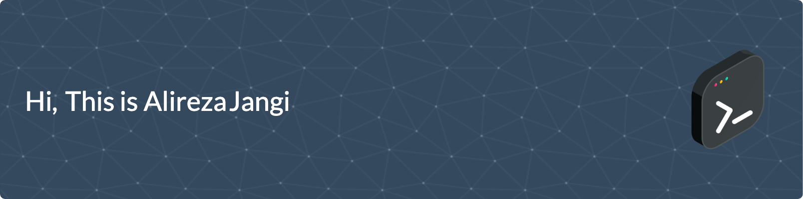

<table>
  <tr>
    <td>
      
  </td>
    <td>
      
  </td>
  </tr>
</table>
 

<!--
- 🏢 I'm currently working at **Snapp Doctor**
- ⚙️ I use daily: `.php`, `.js`, `.html`
- 🌱 I’m currently learning **DevOps Engineering**
- 🌍 I'm mostly active within the **Laravel Community**
- 🌱 Learning all about **Open Source**
- 💬 Ask me about **DevOps**, **Docker**, **Laravel**, **React**, **React Native**
- 📫 Reach me: [LinkedIn](https://www.linkedin.com/in/alireza-jangi-9b280867/) - [E-Mail](mailto:ajangi@hotmail.com)
- ⚡️ Fun fact: I'm a huge fan of Turkish Movies
-->

  
  
  
  
  
  
  
  
  
  
  
  
  
  
  
  
  
  
  
  
  
  
  
  
  
  
  
  
  
  
  
  
  
  

<!--
**ajangi/ajangi** is a ✨ _special_ ✨ repository because its `README.md` (this file) appears on your GitHub profile.
Here are some ideas to get you started:

- 🔭 I’m currently working on ...
- 🌱 I’m currently learning ...
- 👯 I’m looking to collaborate on ...
- 🤔 I’m looking for help with ...
- 💬 Ask me about ...
- 📫 How to reach me: ...
- 😄 Pronouns: ...
- ⚡ Fun fact: ...
-->
